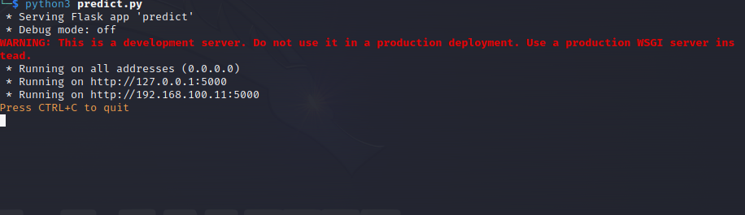
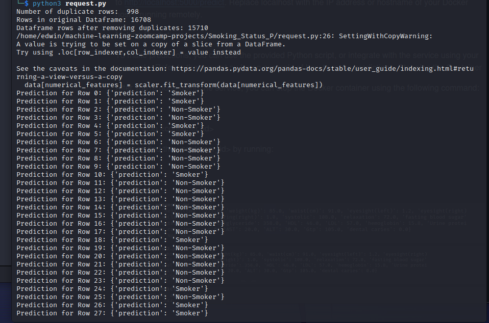
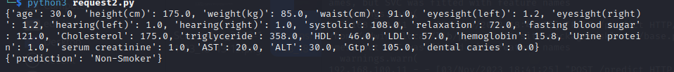

Project Description

Problem Statement:

Smoking is a major public health concern, and the need for effective smoking cessation strategies is paramount. Evidence-based treatments have been proposed to aid individuals in quitting smoking, but the success rate remains relatively low, with less than one-third of participants achieving abstinence. Many healthcare professionals find counseling for smoking cessation to be ineffective and time-consuming, leading to a lack of routine implementation in daily practice. This inefficiency necessitates a more targeted approach to identify individuals with a higher likelihood of quitting smoking successfully.

The Challenge:

To address the challenge of low smoking cessation success rates, this project aims to develop a predictive model that can identify an individual's smoking status based on a set of bio-signals and health-related features. By creating such a model, we can provide a valuable tool for healthcare professionals, public health initiatives, and individuals themselves to assess the likelihood of quitting smoking.

Machine Learning Approach:

To address these challenges, l am adopting a machine learning approach to develop a predictive model. By leveraging a dataset with bio-signals and health-related features, aim to create a model that can predict whether an individual is a smoker or a non-smoker. The predictive model will provide an estimation of the likelihood of quitting smoking for each individual smoker, thereby assisting healthcare providers in identifying those who may benefit the most from smoking cessation interventions.

Outcome:

The outcome of this project will be a machine learning model that predicts smoking status based on bio-signals and health-related features. This model can be deployed for real-world applications, such as assessing smoking behavior in healthcare settings and supporting individuals on their journey to quit smoking.

## Prerequisites

Before you can run this project, ensure that you have the following dependencies installed:

- Docker: [Install Docker](https://docs.docker.com/get-docker/)

## Running the Project

Follow these steps to run the project:

1. Clone the project repository to your local machine:

   ```bash
   git clone <repository_url>
   cd Smoking_Status_P

Build the Docker image:

bash

docker build -t smoker_prediction .

Run the Docker container:

bash

docker run -p 5000:5000 smoker_prediction

The service should now be running in the container, and you can access it by sending POST requests to http://localhost:5000/predict. Replace localhost with the IP address or hostname of your Docker host if running remotely.

Making Predictions

To make predictions, you can use the provided Python script, or integrate with the service using your own code. Refer to the request.py for an example of how to make predictions.
Stopping the Container

After you're done using the service, you can stop the Docker container using the following command:

bash

docker stop <container_id>

You can find the <container_id> by running:

bash

docker ps






Contributors

Edwin karanja
